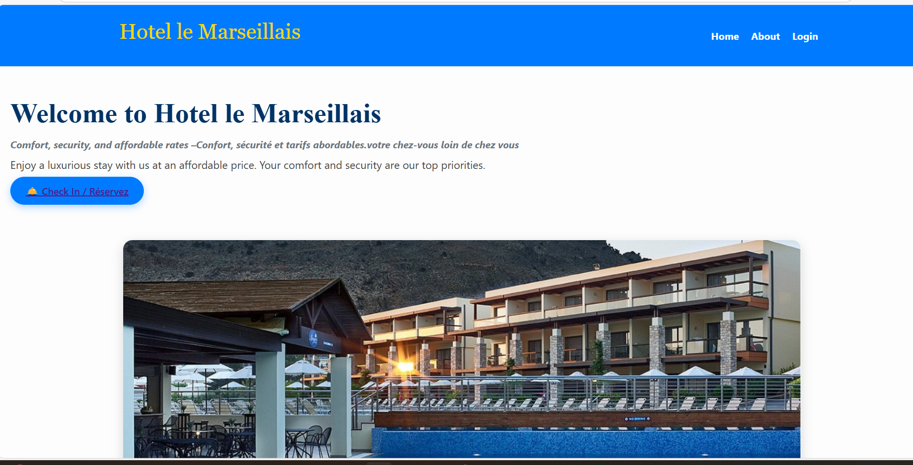
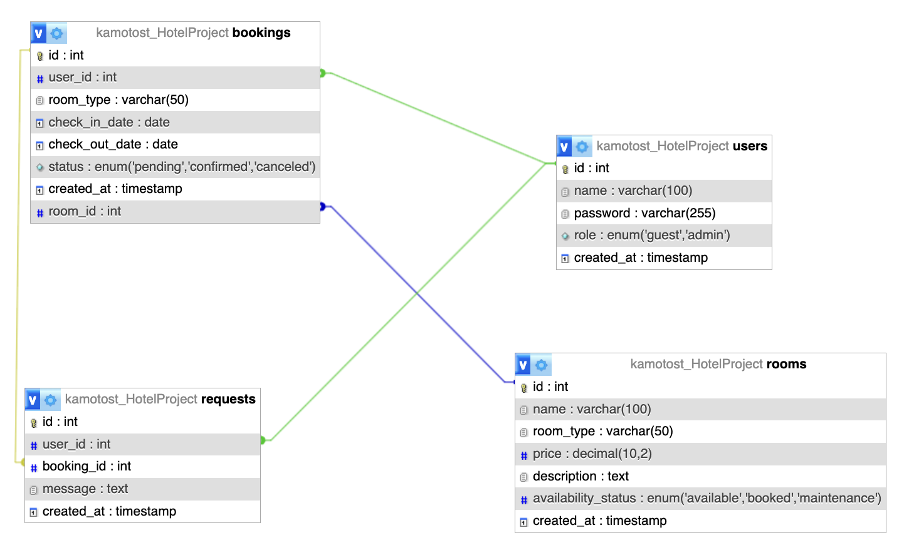
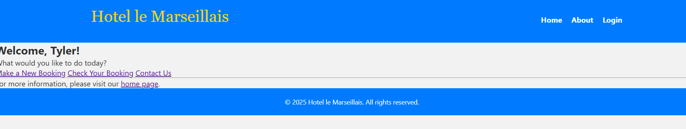
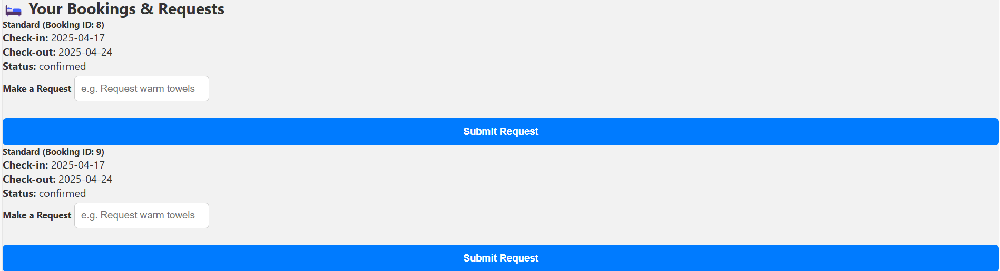
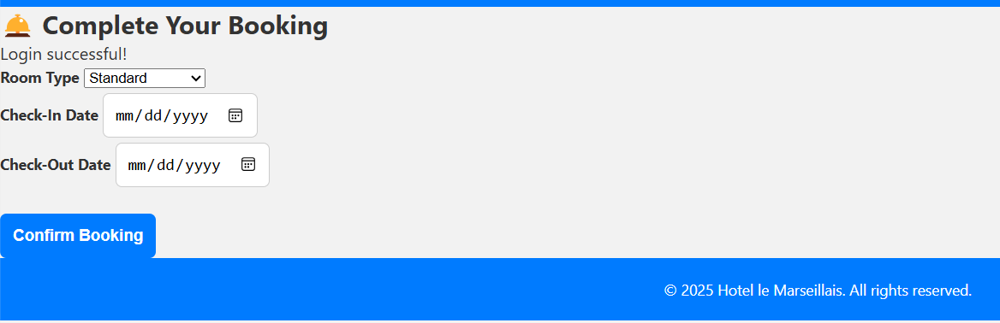
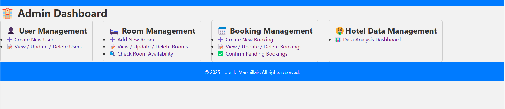
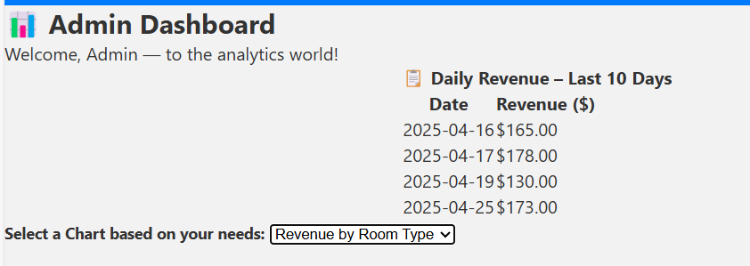

## 🏨 Hotel le Marseillas Booking App

This is a hotel room booking management system, built with Python and MySQL. It allows guests to check availability, book rooms, and submit service requests, while admins can manage users, rooms, and bookings.

---

## Sample Users

| Username | Role  | Password |
|----------|-------|----------|
| Shingai  | Admin | PTSD     |
| Tyler    | Guest | Please   |

---

## Relational Schema


You can refer to the sql document for more information about the creation of tables.


---

## Tech Stack

- Python / Flask  
- HTML/CSS (Jinja templates)  
- Flask-Session  
- MySQL  

---

## Project Structure

- `app.py` — 🚀 Main entry point and API controller  
- `baseObject.py` — 🧱 Core DB handler (CRUD ops)  
- `Booking.py` — 📝 Manages bookings  
- `User.py` — 🔐 Handles users, roles, login  
- `Room.py` — 🛏️ Manages room data and availability  
- `config.yml` — ⚙️ DB config  
- `Templates.html` — 🖼️ Frontend HTML templates 

---

## Key Concepts

| Class       | Purpose                                                                 |
|-------------|-------------------------------------------------------------------------|
| baseObject  | General DB connection and queries                                       |
| Booking     | Bookings, updates, special requests                                     |
| User        | Authentication, role-based login, validation                           |
| Room        | Room creation, updates, availability checks                             |

---

## Setup Instructions

1. **Install dependencies**

```bash
pip install pymysql pyyaml
```

2. **Create your database and tables** (users, rooms, bookings, requests)

3. **Configure connection** via `config.yml`

```yaml
db:
  host: localhost
  port: 3306
  user: your_username
  passwd: your_password
  db: your_database

tables:
  Booking: bookings
  user: users
  Room: rooms
```

4. **Run the application**

```bash
python app.py
```

Visit `127.0.0.1` in browser.

---

## Features

### Users (Guest)
- Register/login with hashed password
- View bookings
- Submit special requests

### Users (Admin)
- Dashboard access
- Manage users and bookings

### Rooms
- Add/search rooms
- Availability by type/dates

### Bookings
- Create/update/cancel bookings
- Assign rooms
- Special requests

### Reports
- Booking by room type
- Revenue stats
- Top guests
- Daily revenue

---

## Application Logic

### 1. User Types

- **Guest**
  - Can register/login
  - Can book/search rooms
  - Can submit/view special requests

- **Admin**
  - Can manage rooms/bookings/users
  - Can resolve requests

### 2. Login Flow

- User submits login credentials
- System hashes password and authenticates
- Redirect based on role (admin/guest)

---

## Guest Actions

- **View available rooms**
- **Create bookings**


**View past/upcoming bookings and Submit special requests**


---

## Admin Actions

- View/confirm/cancel bookings
- Add/update/check room availability
- Manage users and guest requests
- Visual dashboard with reports


---

## Dashboard Visualizations

| Chart Type          | Function                    | Description                       |
|---------------------|-----------------------------|-----------------------------------|
| Pie Chart           | `get_bookings_by_room_type()` | Bookings by room type             |
| Bar Chart (Vertical)| `get_revenue_by_room_type()` | Revenue per room type             |
| Bar Chart (Horiz.)  | `get_top_5_guests()`         | Most frequent guests              |
| Line Chart          | `get_bookings_over_time()`   | Booking trends over time          |
| Line Chart          | `get_daily_revenue()`        | Daily confirmed booking revenue   |



Example SQL for Revenue by Room Type:

```sql
SELECT b.room_type, COUNT(*) AS bookings, 
       ROUND(COUNT(*) * AVG(r.price), 2) AS revenue 
FROM bookings b 
JOIN rooms r ON b.room_type = r.room_type 
WHERE b.status = 'confirmed' 
GROUP BY b.room_type;
```

---

## Database Connection & CRUD

- All handled via `baseObject` methods:
  - `insert()`, `update()`, `deleteById()`, `getById()`, etc.
- Configuration-driven (YAML)

---

## Design Highlights

- Lightweight custom CRUD inheritance
- Context manager support (`__enter__`, `__exit__`)
- Modular, extensible design
- Secure session management

---

## Example Usage

**Create a Booking**

```python
from Booking import Booking

with Booking() as booking:
    booking.create_booking(
        user_id=1,
        room_type='Deluxe',
        check_in_date='2025-05-01',
        check_out_date='2025-05-03'
    )
```

**Add a Room**

```python
from Room import Room

with Room() as room:
    room.add_room(
        name="Ocean View Suite",
        room_type="Deluxe",
        price=350.00,
        description="Overlooks the ocean"
    )
```
## 📌 Future Improvements

- 🧾 Add payment integration (Stripe or PayPal)  
- 📧 Email notifications for booking confirmations and reminders  
- 🧹 Cleaning schedule management for housekeeping staff  
---

## Notes

- Server-side session management
- RBAC-based dashboard & permission system
